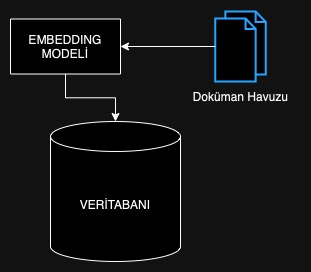
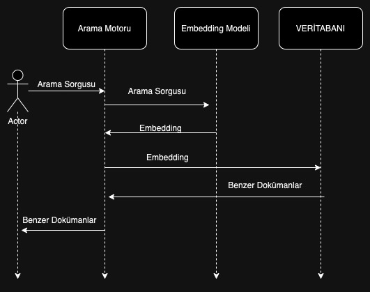

# Anlamsal arama Motorlarına Giriş

Bu dosya içerisinde; Anlamsal arama motorları nelerdir, nasıl çalışırlar, hangi yöntemleri uygularlar gibi sorularını bulabilir, aynı zamanda vektör veritabanı kurulumu ve örnek kullanım kodlarına da ulaşabilirsiniz.

##  İçindekiler
1. [Vector DB nedir?](#1-vektör-veritabanı-nedir)
2. [Qdrant Kurulumu](#2-qdrant-kurulumu)
3. [Embedding Modelleri Nelerdir, Nasıl Kullanılır?](#3-embedding-modelleri-nelerdir-nasıl-kullanılır)
4. [Demo](#4-demo)


## 1. Vektör Veritabanı Nedir?

Yazılım uygulamalarında veritabanları sıklıkla kullanılır. Geliştirilen uygulama ister bir websitesi isterse yapay zeka uygulaması olsun, gerek uygulama içerisinde kullanacağımız gerekse kullanıcıdan alacağımız her türlü bilgiyi saklamak için veritabanlarına ihtiyaç duyarız.

Vektör veritabanları adından da anlaşılabileceği üzere vektör verilerini saklamakta ve bu vektörler üzerinden optimize bir şekide arama yapmamıza olanak sağlamaktadır. Peki anlamsal arama motorlarında veya büyük dil modellerinde hangi aşamada ve amaçla bunları kullanmaktayız?

Anlamsal arama motorları metinlerin anlamlarını temsil etmek için makine öğrenmesi yöntemlerinden faydalanmaktadırlar. Bu makine öğrenmesi yöntemlerinden en yaygın olanı ve yıllariçerisinde gelişmiş olanı "Embedding" olarak adlandırdığımız metini sayılardan oluşan bir liste olarak temsil etmekten geçmektedir. İlerleyen bölümlerde bu yöntemler detaylı olarak anlatılacaktır. 

Vektör veritabanları verilen bir "embedding" ile içerisinde bulunan diğer embedding'leri karşılaştırarak aralarındaki mesafeyi ölçebilmektedirler. Bu mesafe bize iki dökümanın birbirlerine ne kadar benzer olduklarını göstermektedir. Mesafe ne kadar az ile dökümanların birbirlerine o kadar benzer olduğunu varsayarız. Aradaki mesafeyi ölçmek için birden fazla yöntem bulunmaktadır, bunların detayları PT1-intro kısmında incelenecektir.

Birçok farklı veritabanı vektör saklama ve arama özelliği sunmaktadır. Genel olarak hepsinin çalışma mantığı aynıdır fakat aralarında memory tüketimi ve hız gibi farklılıklar bulunmaktadır. Biz bu eğitim serisi boyunca *qdrant* veritabanını kullanacağız.

## 2. Qdrant Kurulumu

qdrant, anlamsal arama ve vektör veritabanı çözümüdür. Metinlerin anlamlarını temsil etmek için embedding yöntemlerini kullanır ve vektörler üzerinde optimize bir şekilde arama yapmayı sağlar.

qdrant veritabanını indirmenin birden fazla yöntemi bulunmaktadır, Docker bunlar içerisinde en kolay yöntemlerden birisi olabilir. Bu seri içerisinde biz bir docker-compose dosyası yardımı ile qdrant veritabanını çalıştıracağız.

Diğer indirme seçeneklerini görmek için qdrant'in kendi dokümanlarını [buradan](https://qdrant.tech/documentation/guides/installation/) inceleyebilirsiniz.

qdrant'ı kurmak için aşağıdaki adımları izleyebilirsiniz:

1. qdrant'ı yüklemek için terminale aşağıdaki komutu girin:
    ```
    pip install qdrant-client
    ```

2. qdrant'ı başlatmak için terminale aşağıdaki komutu girin:
    > ! Bu komutu çalıştırmadan önce bilgisayarınızda Docker'ın yüklü ve çalışır durumda olduğundan emin olun.

    ``` bash
    docker-compose -f path/to/file/docker-compose.yml up
    ```

3. qdrant'ı kullanmaya başlayabilirsiniz.


## 3. Embedding modelleri nelerdir, nasıl kullanılır?

Metinleri vektörel olarak temsil etmek kullanılan embedding modelleri yıllar içinde gelişmiş ve yeni yöntemler ortaya çıkmıştır. Günümüzde bunlardan en yaygın ve sık kullanılan hali SentenceTransformer modelleridir. 
> SentenceTransformer modelleri benzer metinlerin vektörleri arasındaki mesafeyi azaltıp, benzer olmayan metinlerin vektörleri arasındaki mesafeyi arttırarak eğitilen modellerdir.\
> Bu modellerin eğitimine ve Fine-Tuning konularını ilerleyen bölümlerde detaylı bir şekilde göreceğiz.

BERT temelli bir model mimariye sahip olan SentenceTransformer'lar hakkında detaylı bilgiye [buradan](https://www.sbert.net) ulaşabilirsiniz.

HuggingFace sitesinde sunulan binlerce modele bu [linkten](https://huggingface.co/models?pipeline_tag=sentence-similarity&sort=trending) bakabilir istediğiniz modeli kendi projelerinizde kullanabilirsiniz. SentenceTransformers modellerini kullanmak için aşağıdaki adımları takip edebilirsiniz:

1. sentence-transformers kütüphanesini yüklemek için aşağıdaki komutu çalıştırın:
    ```bash
    pip install sentence-transformers
    ```
2. HuggingFace üzerinden bir model seçin ve bunu kopyalayın.
    ```Python
    MODEL_NAME_OR_PATH = "sentence-transformers/all-mpnet-base-v2"
    ```
3. Modeli yükleyin
    ```Python
    from sentence_transformers import SentenceTransformer
    
    model = SentenceTransformer(MODEL_NAME_OR_PATH)
    ```

    ***Kodu ilk defa çalıştırdığınız zaman ilk başta modeli yükleyeceği için bu biraz uzun sürebilir. Daha sonradan tekrar çalıştırdığınızda bu süre büyük oranda azalacaktır.***

4. Modele bir metin verip embedding elde edebilirsiniz:
    ```Python
    text = "Bu bir test cümlesidir."
    embed = model.encode(text)
    ```
    *encode* fonksiyonu içerisine liste olarak birden fazla metin de alabilmektedir. Bu yöntem, çok sayıda dokümanın embedding'lerini oluşturmak istediğimiz zaman gerekli olan süreyi büyük oranda kısaltmaktadır. Detaylarına daha sonraki bölümlerde değineceğiz.


## 4. Demo

Şimdiye kadar Vektör veritabanı ve Embedding modellerinden bahsettik. Şimdi sıra elimizdeki dokümanların Vektör veritabanına yüklenip anlamsal arama gerçekleştirmede.

> **!** Burada yazacağımız bütün kodları [notebook](connection.ipynb) içerisinde bulabilirsiniz.

1. Client ve Modelin kurulması

    Öncelikle Vektör veritabanına bağlanacağımız bir *client* oluşturalım. Bu *client* sayesinde veritabanına doküman ekleyebilir/silebilir ve aramalar gerçekleştirebiliriz.
    ```Python
    import qdrant_client

    client = qdrant_client.QdrantClient(host="localhost", port=6333)
    ```

    Daha sonrasında Embedding modelimizi yükleyelim. 
    ```Python
    from sentence_transformers import SentenceTransformer

    MODEL_NAME_OR_PATH = "sentence-transformers/all-mpnet-base-v2" 
    model = SentenceTransformer(MODEL_NAME_OR_PATH)
    ```

2. Veritabanında Collection oluşturulması

    Collection'ı SQL tabanlı veritabanlarındaki *tablo* gibi düşünebilirsiniz. Burada farklı olan şey, vektör araması yapabilmek için, bizim modelimize uygun vektör parametrelerini vermemizdir.
    Bunu yapmak için Client objemizden faydalanacağız.
    ```Python
    from qdrant_client.http.models import VectorParams, Distance

    COLLECTION_NAME = "example_collection"

    client.create_collection(
        collection_name=COLLECTION_NAME,
        vectors_config=VectorParams(
            size=model.get_sentence_embedding_dimension(),
            distance=Distance.COSINE,
        )
    )
    ```
    Collection oluşturmak için bir isim vermemiz gerekiyor, bu ismi daha sonradan içerisine eklediğimiz dokümanları bulmak için kullanacağız. Vektör için belirtmemiz gereken iki parametre bulunuyor ve bunları *qdrant_client.http.models* kullanarak tanımlayabiliriz.
    * ***size:*** Embedding modelimizin çıktısının boyutunu belirtmemiz gerekmektedir. Eğer SentenceTransformer haricinde bir model kullanıyorsanız buraya uzunluğu direkt olarak ekleyebilirsiniz.
    * *d**istance:*** Vektör araması için kullanılacak olan uzaklık formülünü temsil eder. Biz en sık kullanılan yöntem olan COSINE yöntemini kullandık. Farklı uzaklık ölçümlerine ve bunların detaylarına bir sonraki bölümümüzde yer vereceğiz.

3. Verilerin Okunması

    Bu örnek kapsamında kullanacağımız [veriye](data.json) buradan göz atabilirsiniz. Bir *.JSON* dosyası olduğu için bunu *json* modülü kullanarak yükleyeceğiz.

    ```Python
    import json

    DATA_PATH = './data.json'
    with open(DATA_PATH, 'r') as f:
        data = json.load(f)
    ```
    Bu dosya içerisinde 14 farklı veri bulunmakta ve veriler şu şekilde gözükmektedir:

    ```JSON
    {"title": "Data Structures and Algorithms",
    "date": "2023-08-02",
    "author": "Emily Johnson"}
    ```

4. Verilerin Collection İçerisine Eklenmesi

    

    Verileri veritabanına eklemek için yapmamız gereken birkaç işlem bulunmaktadır. Bunlar şu şekilde sıralanabilir:
    1. **Embedding oluştur**
    2. **Dokümanı PointStruct objesi haline getir**
    3. **Vektör veritabanına ekle.**

    ```Python
    from qdrant_client.http.models import PointStruct

    points = []
    for idx, doc in enumerate(data):
        text = doc['title']
        vector = model.encode(text).tolist()
        
        points.append(PointStruct(
            id=idx,
            vector=vector,
            payload=doc
        ))

    client.upsert(
        collection_name=COLLECTION_NAME,
        points=points,
        wait=True 
    )    
    ```
    Bir *for* döngüsü ile elimizdeki verilere tek tek ulaşıyoruz, *embedding*'ini elde etmek istediğimiz kısmı modele göndererek *vector* değişkeninde saklıyoruz.

    **PointStruct** objeleri **id**, **vector** ve **payload** olmak üzere 3 parametre amaktadırlar. **id** değeri her doküman için farklı olmalıdır. **payload** içerisine de json formatında istediğimiz veriyi verebiliriz. Bu kısım vektör haricinde doküman hakkında saklamak istediğimiz verilerden oluşmalıdır.

    Bütün dokümanlarımızın PointStruct hallerini bir listede sakladıktan sonra bunları **qdrant client** yardımı ile daha önceden oluşturduğumuz **collection** içerisine yüklüyoruz.

> Verilerin collection içerisine eklenmesi tek seferlik bir işlemdir. Kodun bu kısmını yalnızca bir kere çalıştırmalıyız, aksi takdirde dokümanların kopyalarını oluşturmuş oluruz.

5. Collection İçerisinde Anlamsal Arama Yapılması

    Anlamsal arama motoru için gerekli olan dokümanların veritabanına eklenmesi işlemini tamamladık. Sırada yeni gelen bir *sorgu* için en alakalı veya benzer dokümanların bulunması işlemi vardır.

    Veritabanında anlamsal arama yapabilemiz için arama sorgusunun da *Embedding*'ini oluşturmamız gerekmektedir. Çünkü benzerliği metinler üzerinden değil, vektörler üzerinden gerçekleştirmek istiyoruz.

    

    **qdrant** ile bunu yapması oldukça kolaydır, yapmamız gereken tek şey bir *collection* belirtip, arama yapılacak *embedding*'i vermemizdir.

    ```Python
    QUERY = "AI"
    query_vector = model.encode(QUERY).tolist()

    search_result = client.search(
        collection_name=COLLECTION_NAME,
        query_vector=query_vector,
        limit=2 # return top 3 results.
    )
    ```
    **client.search** bize bir liste döndürmektedir. Burada yine for döngüsü kullanarak dökümanları yazdıralım:
    ```Python
    for item in search_result:
        print(f"{item.id} - {item.score} - {item.payload}")
    ```

    ```Bash
    1 - 0.50849575 - {'author': 'William Smith', 'date': '2023-08-01', 'title': 'Artificial Intelligence Trends'}
    13 - 0.45802432 - {'author': 'Michael Brown', 'date': '2023-08-03', 'title': 'Machine Learning Basics'}
    ```

    > Arama sorgumuz birebir dokümanların başlıklarında bulunmasa da, embeddinglerini kullandığımız için AI ve Machine Learning'in birbirine benzer olduklarını yakalayabildik.


Serimizin ilk kısmının sonuna gelmiş bulunmaktayız. Bu bölümde anlamsal arama motorlarına giriş yaptık, ilerleyen bölümlerde hem anlamsal benzerliğin nasıl çalıştığını daha iyi anlayacak hem de kendi modellerimizi geliştirerek başarı metriklerimizi yukarıya çekeceğiz.