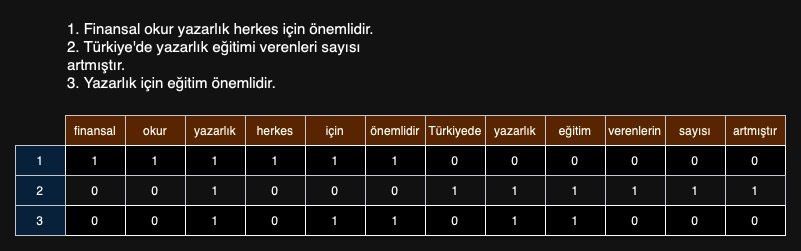
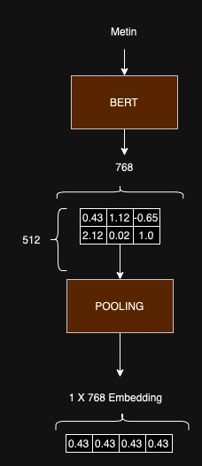
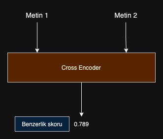
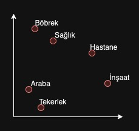

# Anlamsal Arama Motorları Temel Giriş

Bir önceki bölümde vektör veri tabanlarından, vektörlerin nasıl oluşturulduğundan ve vektör veri tabanı kullanılarak örnek bir anlamsal arama yapmıştık. Bu bölümde ise anlamsal arama motorlarının temelini oluşturan embedding modelleri ve benzerlik hesaplama yöntemlerinden bahsedeceğiz.

## İçindekiler
1. [Embedding nedir?](#1-embedding-nedir)
2. [Embedding Model Çeşitleri](#2-embedding-model-çeşitleri)
    * [SentenceTransformers](#sentenceTransformers)
    * [Cross Encoders](#cross-encoders)
3. [Anlamsal Benzerlik](#3-benzerlik-nasıl-hesaplanır)
    * [Dot Product](#dot-product)
    * [Cosine Similarity](#cosine-similarity)
    * [Euclidean Distance](#euclidean-distance)


## 1. Embedding nedir?
Eğer daha önceden yapay zeka veya makine öğrenmesi ile ilgilendiyseniz bu algoritmaların sayılar ile işlemler yaptığını bilirsiniz, çünkü bu algoritmalar kelimelerin ne demek olduğunu aslında bilmiyor. Bu yüzden Doğal Dil İşleme algoritmaları bir şekilde metinleri sayılar ile temsil etmek zorundadırlar. Bunlara arama motorları, ChatGPT gibi sohbet yapay zekaları veya metin içerisinden bir bilgi çıkartmak isteyen herhangi bir uygulama örnek olarak verilebilir.

Embedding dediğimiz şey temelde kelimelerin numaralardan oluşan bir listedir. Yıllar içerisinde bu numaraları oluşturmanın birçok farklı yöntemi keşfedilmiştir. Bunlardan en basiti **CountVectorizer** olarak bilinen, kelimelerin frekansı ile temsil etmektir. Bu yöntemde öncelikle bütün dokümanlarda kullanılan kelimeler bir listeye konulur, her bir doküman ise bu kelimelerden kaç tane içerdiğine göre numaralandırılarak temsil edilir.



Yukarıda gözüken her bir satır ilgili metinin embedding'i olarak kullanılabilir. Örnekte 12 farklı kelime bulunduğu için metinler 12 boyutlu bir vektör olarak temsil edilmektedir.

## 2. Embedding Model Çeşitleri

Tabi ki **CountVectorizer** bir metini temsil etmek için kullanılabilecek en basit yöntemdir ve tahmin edilebileceği üzere performans olarak oldukça kötü sonuçlar vermektedir. Geçmişten günümüze kadar sıklıkla kullanılan, adından sıklıkla söz ettirmiş ve birçok alanda kullanılmış bazı embedding modelleri:

* CountVectorizer
* Term Frequency Inverse Document Frequency (TF-IDF)
* Word2Vec
* GloVe
* fastText
* BERT
* SentenceTransformers
* Cross Encoders


Biz bu tutorial boyunca ağırlıklı olarak SentenceTransformers ve Cross Encoders üzerinde duracağız. Çünkü buu modellerin temelinde BERT modeli yatmaktadır ve bu sayede performansları diğer yöntemlere göre çok daha yüksektir. State-of-the-art yani şu anda en iyi performansı gösteren yöntemler olarak kabul edilebilirler.  Bu modeller eğitim sırasında cümlelerin benzerliklerini ve farklılıklarını öğrendikleri için, cümlelerin anlamını temsil etme konusunda oldukça başarılıdırlar.


### SentenceTransformers
SentenceTransformers modelleri cümleleri, kelimeleri veya dokümanları temsil etmek için kullanılabilir. Bu modeller temelde iki farklı katmandan oluşmaktadırlar:
1. BERT modeli
2. Pooling katmanı

BERT modeli transformer tabanlı bir modeldir ve cümlelerin anlamını öğrenmek için eğitilmiştir. Eğitimi genellikle MNR (Masked Language Model) yöntemi yani maskelenmiş dil modeli yöntemi ile yapılmaktadır. Bu yöntemde cümlelerin içerisinden rastgele kelimeler maskelenerek modelin bunları tahmin etmesi istenir ve model bu sayede cümlelerin anlamını öğrenir.



BERT çıktı olarak 512x768 boyutunda bir matris verir. 512 token sayısını temsil ederken, 768 ise her bir token için oluşturulan vektörlerin uzunluğunu temsil eder. Pooling yönteminde ise bu vektörlerin nasıl işleneceğine karar verilir. En yaygın pooling yöntemi **mean pooling** adı verilen yöntemdir. Bu yöntemde tüm token vektörlerinin ortalaması alınarak 1x768 boyutunda bir vektör elde edilir.
**mean pooling** dışında **mean pooling**, **max pooling**, **cls token pooling** gibi birçok farklı pooling yöntemi bulunmaktadır.


### Cross Encoders
Cross Encoder modelleri ise iki farklı cümlenin karşılaştırılması için kullanılır. **SentenceTransformers** modellerindeki gibi ayrı ayrı embeddingler alınarak karşılaştırma yapmak yerine, iki cümleyi aynı anda modelin içerisine vererek aradaki benzerliğin hesaplanmasını sağlar. 



Cross Encoders modelleri genellikle daha başarılı sonuçlar vermektedirler fakat dokümanların ayrı olarak temsil edilmesini sağlayamadıkları için oldukça yavaş çalışırlar. Bu sebeple genellikle az sayıda dokümanın bulunduğu durumlarda kullanılırlar, ilerleyen bölümlerde bu modellerin hangi aşamada kullanılabileceğini göreceğiz.


## 3. Anlamsal Benzerlik
Şimdiye kadar dokümanları nasıl temsil edeceğimizden bahsettik, şimdi ise dokümanların temsillerini kullanarak aralarındaki benzerliği nasıl hesaplayacağımızdan bahsedeceğiz. Benzerlik dediğimiz şey matematiksel olarak vektörler arasındaki mesafeyi hesaplamak demektir. Vektörler arasındaki mesafe ne kadar küçükse dokümanlar arasındaki benzerlik o kadar yüksek kabul edilir.

Bu düşüncenin altında yatan en büyük düşünce ise şudur: embedding hesaplaması sırasında kelimelerin anlamları temsil edildiği için, birbirine benzer anlamda olan metinlerin vektörleri de birbirine benzer olacaktır yani birbirine çok yakın olacaktır.



Yukarıdaki fotoğrafta iki boyutlu vektör uzayında kelimelerin temsilleri yer almaktadır. Anlamsal olarak birbirine yakın olan böbrek-sağlık veya araba-tekerlek gibi kelimeler birbirlerine daya yakın olurken birbirinden anlamsal olarak uzak olan tekerlek-böbrek gibi kelimeler birbirlerine daha uzak olacaktır.
> Gerçekte kullandığımız embedding modelleri yüzlerce boyuttan (çoğunlukla 768) oluşmaktadır. Bu fotoğraf sadece anlamak için basitleştirilmiş bir örnektir.


Benzerlik hesaplamak için kullanılan birçok yöntem bulunmaktadır, bunlardan bazıları:

* Cosine Similarity
* Euclidean Distance
* Manhattan Distance
> Burada anlatılan bütün formüllerin kodları repomuzda bulunmaktadır, [buraya](./distances.py) tıklayarak kodların bulunduğu dosyaya erişebilirsiniz.


### Dot Product
İki vektör arasındaki mesafeyi ölçekte kullanılan yaygın yöntemlerden birisi olan **Dot Product**, aynı zamanda **Cosine Similarity** formülünün içerisinde de bulunmaktadır. Dot Product hesaplaması oldukça kolaydır, iki vektörün elemanlarının sırasıyla çarpılıp sonucun toplanması ile hesaplanır. Numpy kütüphanesi kullanarak hesaplama yapılması oldukça kolaydır:

```Python
import numpy as np

distance = np.dot(embed1, embed2)
```

Numpy kullanmadan hesaplamak isterseniz aşağıdaki kodu kullanabilirsiniz:
```Python
distance = sum(i*j for i,j in zip(embed1, embed2))
```


### Cosine Similarity
Cosine Similarity, iki vektör arasındaki açıyı hesaplayarak benzerlik hesaplar. Cosine Similarity değeri -1 ile 1 arasında değişir, -1 tamamen zıt iken 1 tamamen benzer anlamına gelir. Cosine Similarity hesaplamak için aşağıdaki formül kullanılır:
> **dot(embed1, embed2) / (norm(embed1) * norm(embed2))**

*dot product*'ın detaylarını yukarıda anlatmıştık, *norm* dediğimiz şey ise her bir elemanın karesinin toplamının kareköküdür. Bu iki değeri kullanarak Cosine Similarity hesaplanır. Benzerlik hesaplamaları için en sık kullanılan formul olan Kosinüs benzerliğini Python ile hesaplaması oldukça kolaydır:
```Python
dot_product = np.dot(embed1, embed2)
norm_embed1 = np.linalg.norm(embed1)
norm_embed2 = np.linalg.norm(embed2)
cosine = dot_product / (norm_embed1 * norm_embed2)
```

Hiçbir harici kütüphane kullanmadan aşağıdaki kod ile de Kosinüs benzerliği hesabı yapabilirsiniz:
```Python
def dot_scratch(embed1, embed2):
    return sum(i*j for i,j in zip(embed1, embed2))

def norm_scratch(embed):
    return sum(i**2 for i in embed) ** 0.5

def calculate_cosine_scratch(embed1, embed2):
    cosine = dot_scratch(embed1, embed2) / (norm_scratch(embed1) * norm_scratch(embed2))
    return cosine
```

#### Önemli bir not
> Cosine hesaplanmasının performans olarak Dot Product'a göre daha yavaş olacağını tahmin etmiş olabilirsiniz. Vektör Veritabanları burada oluşacak performans kayıplarını minimize etmek için çeşitli optimizasyonlar yapmaktadır. *qdrant* Cosine Similarity ile oluşturulan Collection'lar için indeksleme esnasında normalizasyon işlemini yaparak bu problemi ortadan kaldırmıştır.

### Euclidean Distance
Euclidean distance aslında hepimizin liseden bildiği Pisagor teoremidir. İki vektör arasında kalan doğru parçasına verilen isimdir. Numpy vektörler üzerinde toplama/çıkartma gibi işlemleri kolaylıkla yaptığı için bu hesaplamayı numpy ile yapmak oldukça kolaydır.

```Python
distance = np.linalg.norm(embed1 - embed2)
```

Cosine kadar yaygın olmasa da sık kullanılan yöntemlerden birisidir, çoğu vektör veritabanı Euclidean Distance'ı desteklemektedir. Formül temelde vektörlerin elemanlarının farkının karelerinin toplanması ve ardından karekökünün alınması ile hesaplanmaktadır. Numpy kullanmadan şu şekilde hesaplaması yapılabilir:

```Python
distance = sum([(i-j)**2 for i,j in zip(embed1, embed2)]) ** 0.5
```

